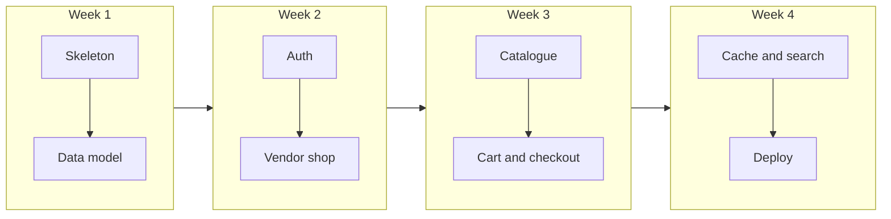

# 1.1 — What you're building

You're building for a local grocery market in a clean editorial style — **name the product yourself.** FreshMarket is just a placeholder in this course; your app might be called GreenBasket, LocalHarvest, or something you invent on the first day. What matters is the *shape* of the thing: a **multi-vendor grocery marketplace** where local shops sell through one shared platform, and customers shop across all of them in a single flow.

> *"The difference between a developer who can follow a tutorial and a developer who gets hired is the second one can explain why their system doesn't leak one shop's data into another."*

By the time you finish this course, you'll have a **real, deployed application** — not a folder of half-finished exercises. A vendor can register, verify their email, open a shop, photograph their produce, and manage incoming orders. A customer can browse every shop on the platform, fill one cart with apples from one vendor and olive oil from another, check out once, and watch the platform split that purchase into separate orders behind the scenes — with the prices they actually paid locked on the receipt forever. You'll have built that, understood it, and be able to defend every decision in it.

---

## Why a multi-vendor marketplace — and not another todo app

Most learning projects stop at **single-user CRUD**: one person, one table, one form. That's a fine place to start, but it's not where real products live. The moment you add a second *owner* to the same database — a second vendor, a second tenant, a second shop sharing one API — the difficulty jumps a full level. The question is no longer "does the insert work?" It's **"whose row is this, and who is allowed to touch it?"**

A multi-vendor marketplace forces you to answer that question on every route, for every query, for the entire life of the project. Miss it once and you've built a silent security bug: Vendor A edits Vendor B's stock. A customer sees another customer's cart. An old order suddenly shows today's price because you stored only a product reference and never snapshotted what was paid.

Those aren't edge cases in this domain — they're the **core engineering problems** of the product. Build this once, explain it cleanly, and you've demonstrated skills that transfer directly to SaaS, B2B platforms, creator marketplaces, and any system where many owners share one codebase.

---

## What makes a grocery marketplace different from "generic e-commerce"

Swapping the word "product" for "listing" isn't enough. The **domain** changes real decisions:

| Generic marketplace | Local grocery marketplace |
|---|---|
| "2 items" in a cart | **2 kg** of rice, **6 pieces** of lettuce — unit and weight matter |
| Product is in stock or not | **Perishable** flag; stock is a decimal (0.5 kg of loose tomatoes) |
| Photo is nice to have | Photo is how you sell produce — storage strategy matters early |
| One order, one seller (often) | **One cart, many vendors** — checkout must split automatically |
| Price on the product page | Price on the product page *and* a **frozen copy** on every past order |

This course uses those domain facts on purpose. When you model a product, you won't get away with `name`, `price`, and `description` alone — you'll need `unit`, `weightOrQuantity`, `stockQty`, and `isPerishable`, because a grocery app without them is the wrong product. When you build checkout, you won't store only `productId` on the order line, because a vendor changes prices every Monday and last Friday's receipt must not rewrite itself.

The domain isn't decoration. It's the reason the schema and the checkout logic look the way they do.

---

## The stack you'll ship with

This course uses the **MERN** family — MongoDB, Express, React, Node.js — plus two production tools you'll meet in the later weeks:

| Layer | Technology | Role in FreshMarket |
|---|---|---|
| **Database** | MongoDB + Mongoose | Users, stores, products, carts, orders |
| **API** | Node.js + Express | REST API; auth; business rules; data isolation |
| **Client** | React (Vite) | Vendor dashboard; customer shop; cart; checkout |
| **Cache** | Redis | Hot catalogue reads; invalidation when products change |
| **Files** | Cloudinary (or S3) | Product photos — never stored as blobs in MongoDB |
| **Deploy** | VPS or PaaS + HTTPS | Live URL; secrets in environment variables |

You are not learning MERN in the abstract. Every chapter attaches to **this** repo: `server/` for the API, `client/` for the React app, both in one repository so you always know where the next file goes.

---

## In plain English — the stack (first time you see these words)

| Word | What it actually is |
|---|---|
| **MongoDB** | A database that stores data as JSON-like documents — good for products, users, carts |
| **Express** | A Node.js library that turns your server into an HTTP API (routes like `GET /products`) |
| **React** | A JavaScript library for building the browser UI — buttons, forms, product grids |
| **Node.js** | JavaScript running on your computer as a server — not in the browser |
| **API** | The server’s menu of URLs the client can call to read or change data |
| **Redis** | A very fast in-memory store used later for caching and background job queues |
| **Cloudinary** | A service that stores image files; your database keeps only the image URL |
| **Deploy** | Putting your app on the internet so anyone with a link can use it |

You do **not** need to memorize this table today. Every chapter re-explains the terms it uses. This is a map for when jargon appears in Week 2 or 3 and you want a one-line reminder.

---

## Common beginner questions

**Q: I've never built a full-stack app. Can I still do this?**  
If you can build a small REST API and a React page that fetches data, yes — read the **Learn it** sections slowly and use the **In plain English** boxes in each chapter. If CRUD is completely new, spend a few days on a tiny todo app first (see 1.5).

**Q: Why one repo with `server/` and `client/`?**  
So you always know where files live and can demo both halves together. The server handles data and rules; the client is what users see in the browser.

**Q: Is this a copy-paste course?**  
No. The course tells you **what** each route must do and **how to verify** it — you write the handler logic yourself.

**Q: Why grocery and not a generic shop?**  
Because units (kg vs pieces), perishables, and multi-vendor checkout change real schema and API decisions — not just the product name.

**Q: What if I get stuck?**  
Read the error first, check **Troubleshooting** at the bottom of the sub-chapter, re-read **Bridge from last chapter** if the chapter feels like a jump. See 1.7 for working rhythm.

---

## What you'll have at the end — in one paragraph and in a list

**One paragraph:** A deployed multi-vendor grocery marketplace with vendor onboarding, product management with photos, a customer-facing catalogue with search and pagination, a multi-vendor cart, checkout that splits into per-vendor orders with snapshotted prices, order tracking for both sides, Redis-backed catalogue caching, and a live HTTPS URL you can put on a portfolio.

**Broken down by milestone:**

**Week 1 — Foundations**
- Both apps boot from one repo (`server/` + `client/`)
- MongoDB connected; configuration from environment variables; no secrets in Git
- Full data model with correct ownership chain; seed data you can inspect in Compass
- First end-to-end moment: the React app calls `GET /health` and displays the response

**Week 2 — Vendor experience**
- Registration, login, JWT + refresh tokens, email verification (OTP)
- Authorization: a vendor cannot read or write another vendor's store or products
- Vendor opens a shop, adds products with units and stock, uploads photos to object storage
- Vendor dashboard: create, edit, publish — all in the browser

**Week 3 — Buyer experience**
- Public catalogue: browse, filter, paginate — without N+1 queries
- Cart persists in the database; items from multiple vendors coexist
- One checkout produces one order per vendor; prices frozen at purchase time
- Customer order history and vendor order list both work in the UI

**Week 4 — Polish & ship**
- Catalogue reads cached in Redis; product updates bust the cache
- Text search on an index; measurably faster than a full collection scan
- Production deployment with HTTPS; app survives a server restart

---

## Why this belongs on a résumé

Interviewers see hundreds of todo apps and weather dashboards. A **multi-vendor marketplace** lets you speak concretely about problems they care about:

- **Authentication vs authorization** — "I know who you are" vs "you may not touch that store"
- **Multi-tenancy / data isolation** — many vendors, one database, zero cross-leaks
- **Price immutability** — why order lines snapshot price and name at checkout
- **Performance** — N+1 queries, pagination, caching, cache invalidation
- **Full-stack delivery** — API, React UI, object storage, deployment

You won't just list those words. You'll have shipped them, broken them in testing, fixed them, and written about them in your learning log. That's the difference between vocabulary and competence.

---

## What this course is — and what it is not

**It is:**
- A **guided build** — concepts taught in depth, then applied step by step on your repo
- **Specs, not solutions** — you'll know exactly which route to create and what it must reject; you write the handler
- **Feature-shaped** — progress is measured by chapters finished ("I built auth", "I built checkout"), not by watching videos
- **Honest about difficulty** — medium level; it assumes you can already build CRUD and climbs from there

**It is not:**
- A copy-paste tutorial — if the course writes the logic for you, it failed
- A concept-only textbook — normalization and RBAC appear **when your project needs them**, wired to files you're about to create
- A payment or logistics course — checkout simulates payment; delivery is a status field, not a tracking integration

---

## The arc in four weeks

Each week ends with something you can **run and demo** — not just something you can explain. Week 1 ends with seeded data in MongoDB and a health check in the browser. Week 2 ends with a vendor listing products with photos. Week 3 ends with a customer completing checkout. Week 4 ends with a public URL.

If at any week boundary your repo can't demo the milestone, that's where your work lives before you move on — not in the next chapter's reading.

---

## A note on naming and ownership

You'll create the Git repository on day one of the build (Chapter 2). From that moment, treat it as **your** product:

- Choose a name that fits the local grocery domain
- Commit daily — your history is evidence of how you work
- Keep a `learning-log/` folder from the start; you'll write in it at the end of every chapter

The course gives you structure and requirements. The name, the copy on the landing page, the exact categories you seed — those are yours. Two mentees following the same guide should not be able to hand in identical repositories.

---

## Before you write a line of code

Read the rest of this introduction chapter in order. It covers:

1. **How to use this course** — the checklist gate, the learning log, how you're judged
2. **The product and its people** — vendors and customers, in plain language
3. **Scope** — what's in, what's deliberately out
4. **Prerequisites** — what you should already be comfortable with
5. **The course outline** — every chapter, in order, with demo targets
6. **Your working rhythm** — habits that keep you moving for four weeks

When you reach the checklist at the end of Chapter 1, tick every box — including the learning-log questions — before you open Chapter 2. Chapter 2 is where your repository gets its skeleton. Everything after that attaches to it.

---

## Key ideas from this page

- You're building a **multi-vendor grocery marketplace** — not single-user CRUD
- The **domain** (units, weight, perishables, multi-vendor cart) drives real schema and checkout decisions
- The **stack** is MERN + Redis + Cloudinary + production deploy
- Each **week** ends with a **demoable milestone** — a running app, not just notes
- Progress is **understanding + shipping** — you'll explain your work in a viva and point at a live URL

Next: how this course is structured, and the one rule that keeps self-paced work honest — the checklist gate.
