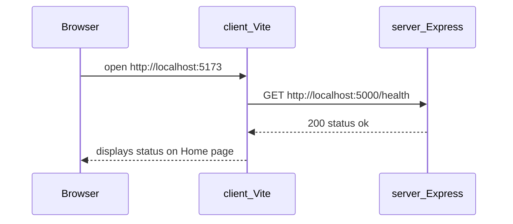

# 2.3 — What you'll build

This sub-chapter is the blueprint. No code yet — just the **tree** you'll grow over the next twelve build steps. Read it once now; return after 2.16 and confirm your repo matches.

## Why this matters for absolute beginners

Staring at a blank folder is overwhelming. This tree is your **map** — not a dump of every file you create today, but the destination after sub-chapters 2.8–2.16. When a step says "create `client/src/api/client.js`," you already know that file sits under `client/`, not inside `server/`. When Chapter 6 says auth routes live in `modules/auth/`, you see that folder was a placeholder you created on purpose. Blueprint first prevents improvising paths that diverge from the course.

## Common beginner questions

**Q: Do I create this entire tree in one command?**  
A: No — build steps add pieces incrementally. Empty module folders may get `.gitkeep` files so Git tracks them.

**Q: Why `shared/` separate from `modules/`?**  
A: Config and database connection serve **every** module — they are cross-cutting infrastructure, not one product feature.

**Q: What's the difference between `app.js` and `server.js`?**  
A: `app.js` **builds** the Express application (middleware, routes). `server.js` **starts listening** on a port. Splitting them helps testing later — you can import `app` without opening a real port.

**Q: Why show empty auth/cart/orders folders now?**  
A: Placeholders remind you where Chapter 5–18 code lands — like labeled empty shelves in a new shop.

---

## The repository at the end of Chapter 2

```
your-marketplace/                 ← root (name yours: GreenBasket, FreshMarket, …)
├── README.md                     ← how to run server + client
├── .gitignore                    ← node_modules, .env, build output
├── learning-log/
│   ├── 01-introduction.md
│   └── 02-project-skeleton.md    ← you'll add this at the gate
├── docs/                         ← empty for now; ERD comes Chapter 5
│
├── server/
│   ├── package.json
│   ├── .env                      ← git-ignored; may be empty until Ch 4
│   └── src/
│       ├── server.js             ← entry: starts listening
│       ├── app.js                ← builds Express app; mounts routes
│       ├── shared/               ← cross-cutting utilities (later: config, db)
│       │   └── .gitkeep
│       └── modules/              ← one folder per domain (mostly empty today)
│           ├── auth/
│           ├── stores/
│           ├── products/
│           ├── cart/
│           └── orders/
│
└── client/
    ├── package.json
    ├── vite.config.js
    ├── index.html
    ├── .env                      ← VITE_API_URL (git-ignored)
    └── src/
        ├── main.jsx              ← React entry
        ├── App.jsx               ← router shell
        ├── pages/
        │   └── Home.jsx          ← fetches /health, displays JSON
        ├── components/           ← empty; shared UI later
        ├── api/
        │   └── client.js         ← base URL + fetch wrapper
        └── hooks/                ← empty; useAuth later
```

That's the **target**. You won't create every folder in one command — build sub-chapters add them step by step so you always know what changed.

---

## Server responsibilities after Chapter 2

| Piece | File / folder | After Ch 2 |
|---|---|---|
| HTTP server | `server.js` | Listens on `PORT` (default 5000) |
| Express app | `app.js` | JSON middleware, CORS, routes mounted |
| Health check | route in `app.js` or `shared/` | `GET /health` → 200 + JSON body |
| Domain modules | `modules/*/` | Empty placeholders — files arrive Ch 5–18 |
| Shared infra | `shared/` | Empty — `config.js`, `db.js` in Ch 4 |

**Not yet on server:** MongoDB, auth, validation library, file upload.

---

## Client responsibilities after Chapter 2

| Piece | File / folder | After Ch 2 |
|---|---|---|
| Dev server | Vite | Serves React on port 5173 (default) |
| Routing | `App.jsx` | Route `/` → Home |
| Home page | `pages/Home.jsx` | Calls API health; shows status |
| API helper | `api/client.js` | Prefixes `VITE_API_URL` on requests |
| Pages / components | folders exist | Vendor & shop pages come Weeks 2–3 |

**Not yet on client:** login, cart, dashboard styling beyond minimal.

---

## The first end-to-end demo



**Screenshot moment:** Browser showing `status: ok` (or your JSON) fetched from *your* API — not hardcoded in React. That proves:

- CORS configured (browser allows cross-origin to API)
- API URL env var correct on client
- Both processes running

---

## npm scripts you'll have

**Server (`server/package.json`):**

| Script | Purpose |
|---|---|
| `dev` | Start API with auto-reload on file changes |
| `start` | Start API for production-style run (same for now) |

**Client (`client/package.json`):**

| Script | Purpose |
|---|---|
| `dev` | Vite dev server |
| `build` | Production bundle (used Chapter 22) |
| `preview` | Preview production build locally |

Exact script commands appear in sub-chapters 2.10 and 2.12 — you'll copy the **tooling** blocks from the course (allowed); you wire them into your project.

---

## Environment variables introduced this chapter

| Variable | Where | Example | Secret? |
|---|---|---|---|
| `PORT` | server | `5000` | No |
| `VITE_API_URL` | client | `http://localhost:5000` | No |

No database URL yet. No JWT secret yet. When those arrive (Chapter 4+), they live in **`server/.env` only** — never in the React bundle unless prefixed for public config (and secrets are never public).

---

## Definition of Done — preview

Chapter 2 checklist (full list in 2.19) requires:

- [ ] Git repo initialized; sensible `.gitignore`; first commits  
- [ ] Server starts; `curl localhost:5000/health` returns 200 JSON  
- [ ] Client starts; Home page loads  
- [ ] Home page shows health response from API (not fake static text)  
- [ ] Folder tree matches module-based convention  
- [ ] Learning log `02-project-skeleton.md` written  

---

## What you'll explain in the viva (eventually)

After this chapter, you should answer without notes:

1. Why `app.js` and `server.js` are separate files  
2. What lives in `modules/` vs `shared/`  
3. Why the client has `api/client.js` instead of fetch URLs scattered in components  
4. Why `.env` is git-ignored but `.env.example` (later) is committed  

---

## Pace through build steps

| Sub-chapter | You'll create |
|---|---|
| 2.8 | Root repo, `.gitignore`, `README`, `learning-log/` |
| 2.9 | Server folder skeleton |
| 2.10 | `package.json`, Express installed |
| 2.11 | Health route working via curl |
| 2.12 | Vite React client scaffold |
| 2.13 | Router + Home placeholder |
| 2.14 | API client helper |
| 2.15 | Home fetches health |
| 2.16 | Full demo verification |

Don't skip ahead. Chapter 4 assumes 2.11's health route exists.

---

## Key ideas

- **Target tree** above is your checklist reference  
- **Two apps**, one repo — `server/` and `client/`  
- **Module folders** empty placeholders until feature chapters  
- **End demo** — React displays API health response  
- **Build steps 2.8–2.16** create this tree incrementally  

Next: formal comparison — layer vs module — and the mandated choice.
