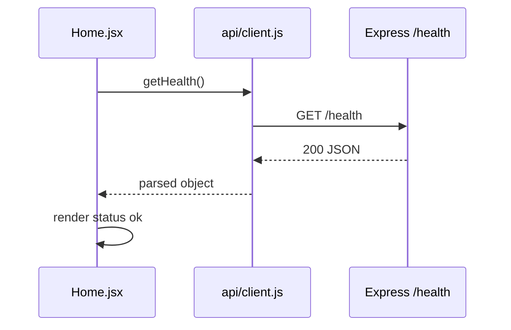

# 2.15 — Connect client to server

**Why this step matters:** This is the chapter's **payoff** — the browser displays data from your API, not hardcoded text. Proving the full-stack loop (React → HTTP → Express) means every later feature reuses the same pattern with more routes.

**Where the project is now:** Server `/health` works in curl. Client Home renders. `api/client.js` reads `VITE_API_URL`.

**After this step:** Home page **fetches live health JSON from your API** and displays it — your first full-stack loop.

---

## Prerequisites for this step

Both processes must run:

```bash
# Terminal 1
cd server && npm run dev

# Terminal 2
cd client && npm run dev
```

**CORS:** Server must allow origin `http://localhost:5173` (or your Vite port). If not done in 2.11, add `cors` middleware now before testing in browser.

---

## Step 1 — Implement fetch on Home page

Update `client/src/pages/Home.jsx`.

**Requirements:**

1. On mount (`useEffect`), call your `getHealth()` from `api/client.js`
2. Manage three UI states:
   - **Loading** — e.g. "Connecting to API…"
   - **Success** — display `status` field from JSON (must show `ok` when API healthy)
   - **Error** — show readable message if fetch fails, non-200, or CORS blocks

3. **Success display must reflect real API response** — not hardcoded string `"ok"` in JSX

4. Optional: display full JSON in `<pre>` for debugging — remove or collapse in polish later

**You write the component logic.**

---

## Step 2 — Manual browser verification

1. With **both** server and client running, open `http://localhost:5173`
2. Wait for loading to resolve
3. **Expected success:** Visible indication that API status is **ok** (wording yours)
4. Stop server (`Ctrl+C` in terminal 1), refresh browser
5. **Expected error:** Home shows error state — not infinite loading, not fake success

Restart server — success returns. This proves client depends on API.

---

## Step 3 — DevTools verification

Open browser DevTools → **Network** tab → refresh.

**Expected:**

- Request to `http://localhost:5000/health`
- Status **200**
- Response body JSON with `"status":"ok"`

If request red/failed:

| Symptom | Fix |
|---|---|
| CORS error in console | Enable cors on server for client origin |
| Failed to fetch / connection refused | Start server; check PORT and URL |
| 404 | Path mismatch — align `/health` and client URL |

---

## Step 4 — Update root README

Document the full local run flow:

```markdown
## Run locally

Terminal 1 — API (port 5000):
cd server && npm install && npm run dev

Terminal 2 — Client (port 5173):
cd client && npm install && npm run dev

Open http://localhost:5173 — Home page should show API status ok.
```

---

## Step 5 — Commit

```bash
git add client/src/pages/Home.jsx client/src/api/ README.md
git commit -m "feat(client): fetch and display API health on Home"
```

---

## ✅ Do / ❌ Don't

**✅ Do:** Handle error state — interviewers notice happy-path-only demos.

**✅ Do:** Keep fetch in `useEffect` with empty dependency array for once-on-mount load.

**❌ Don't:** Hardcode success UI while fetch fails silently in background.

**❌ Don't:** Disable CORS `"*` in production** — localhost wildcard teaching only; tighten in Chapter 22.

---

## Hint

React StrictMode double-invokes effects in development — you might see two health requests on mount. Normal; not a bug.

---

## What you've proven



Every later feature repeats this pattern: **page → api helper → Express module → database**.

---

## Verify

- [ ] Browser shows API status ok with server running  
- [ ] Browser shows error with server stopped  
- [ ] Network tab shows 200 to `/health`  
- [ ] README documents two-terminal workflow  
- [ ] Committed  

---

## Next

**Sub-chapter 2.16:** Formal end-to-end verification checklist — screenshot-worthy demo.
