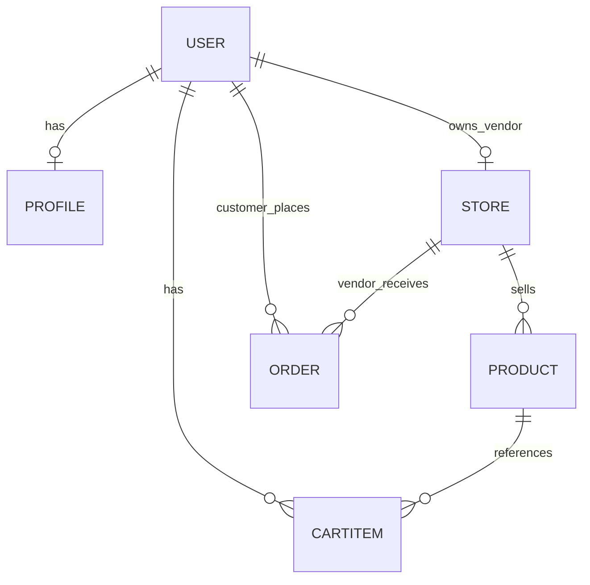

# 3.8 — Audit your planned schema

**Why this step matters:** Concept chapters must still touch your repo — this file is the blueprint Chapter 5 implements. Committing `erd-draft.md` now prevents schema improvisation later and forces embed-vs-reference decisions before Mongoose code exists.

**Where the project is now:** Skeleton runs; module folders empty; no `docs/erd-draft.md` yet.

**After this step:** Your repository contains **`docs/erd-draft.md`** — diagram plus written audit of collections, relationships, embed vs ref, and grocery fields on products.

This is **applied work** — the concept chapter touching your real repo (Rule 23, 28).

## Why this matters for absolute beginners

Concept chapters can feel like homework that never touches code. This step **does** touch your repo — you commit a design file engineers actually keep alongside source. When Chapter 5 asks for `unit` enum on Product, you open **your** ERD instead of guessing. When Chapter 8 tests vendor isolation, your diagram already shows `storeId` chains. Paper design here prevents "I'll fix the schema later" after routes exist.

## Common beginner questions

**Q: My diagram is ugly — is that OK?**  
A: Yes — accurate beats beautiful. Mermaid in markdown, Excalidraw, or a phone photo of paper all pass if relationships are clear.

**Q: Which collections are mandatory on the diagram?**  
A: users, profiles, stores, products, cartitems, orders — with embedded orderItems described in text.

**Q: What if I realize I forgot grocery fields?**  
A: Fix the draft **before** Chapter 5 — that is exactly why this audit exists.

---

## What you must produce

Create **`docs/erd-draft.md`** in your marketplace repo (not the course guides folder).

Minimum sections:

### 1. Title and date

```markdown
# ERD Draft — [Your Product Name]
Author: [you]
Date: [today]
Status: Draft before Chapter 5 implementation
```

### 2. Diagram

Include **one visual** — any of:

- Mermaid `erDiagram` in the markdown file  
- Screenshot of Excalidraw / dbdiagram.io pasted or linked  
- ASCII diagram  
- Photo of paper sketch in `docs/images/erd-draft.jpg` with link from md  

The diagram must show:

- users, profiles, stores, products, cartitems, orders  
- refs: store→user, product→store, cartitem→user/product/store, order→customer/store  
- **embedded** orderItems inside orders (draw as box inside box or notation "embedded array")

### 3. Collection inventory table

| Collection | Purpose | Key fields (bullet list) |
|---|---|---|
| users | login identity | email, passwordHash, role, isVerified, … |
| profiles | display info | userId ref, displayName, … |
| stores | vendor shop | userId ref, name, address, … |
| products | listings | storeId ref, name, price, unit, stockQty, isPerishable, category, imageUrl |
| cartitems | shopping cart | userId, productId, storeId, quantity |
| orders | checkout result | customerId, storeId, status, orderItems[] embedded |

Adjust field names to your taste — consistency matters for Chapter 5.

### 4. Embed vs reference audit

Short paragraph per relationship explaining **embed or ref** using vocabulary from 3.6 and MongoDB docs you read.

### 5. Known open questions

List 1–3 things you'll resolve in Chapter 5 — e.g. "Refresh token: separate collection or user subdocument?"

Open questions prove thinking — not weakness.

---

## Starter Mermaid (adapt — not copy blindly)



Add embedded orderItems in prose below diagram — Mermaid erDiagram doesn't embed cleanly; describe in text:

> *Each ORDER document contains an embedded array `orderItems` with nameAtPurchase, priceAtPurchase, unitAtPurchase, quantity, productId.*

---

## Audit checklist — walk your marketplace flows

### Flow: vendor lists product

- [ ] Product doc has `storeId` ref  
- [ ] Store doc has `userId` ref to vendor  
- [ ] Grocery fields present on product  

### Flow: customer adds to cart

- [ ] CartItem refs product and user  
- [ ] CartItem includes `storeId` for checkout split  

### Flow: checkout

- [ ] One order document **per vendor** in cart  
- [ ] Embedded lines carry **snapshot** fields, not live price only  
- [ ] Stock decrement targets **products** collection (live stock field)  

If any flow breaks on paper, fix ERD before Chapter 5.

---

## Common draft mistakes

| Mistake | Fix |
|---|---|
| Single `users` blob with profile + store + products | Split collections |
| Order lines only `productId` | Add snapshot fields |
| No `storeId` on cart | Add for multi-vendor |
| Products embedded in store document | Separate products collection |
| Missing `unit` on product | Add grocery fields |

---

## Peer review (optional)

If a classmate or mentor available, ask: *"Can you find Vendor B's data in Vendor A's queries from this diagram?"* — isolation should be obvious from refs, not one global products bag.

---

## Commit

```bash
git add docs/erd-draft.md
# if image:
git add docs/images/
git commit -m "docs: add ERD draft before schema implementation"
```

---

## Verify

- [ ] File exists at `docs/erd-draft.md`  
- [ ] Diagram visible or linked  
- [ ] All six collection types addressed  
- [ ] Embedded order lines documented  
- [ ] Committed to Git  

---

## Hint

Stuck on diagram tools? Mermaid in VS Code/Cursor preview renders `erDiagram`. Start ugly; refine in Chapter 5 when schemas reveal typos.

---

## Next

**3.9:** One paragraph per collection tying **actors** (vendor, customer) to **data** — narrative spec for your future self.
