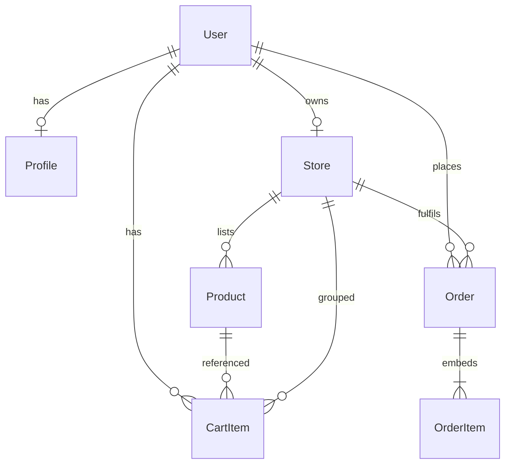

# 5.16 — Draw final ERD

**Why this step matters:** `docs/erd.md` is your portfolio artifact and viva reference — it must match what you actually implemented, not the Chapter 3 draft alone. Diffing draft vs final proves you learned from building schemas.

**Where the project is now:** Models implemented; seed data in Compass. `docs/erd-draft.md` from Chapter 3 may differ from reality.

**After this step:** **`docs/erd.md`** committed — final entity-relationship document matching Mongoose schemas field-for-field.

---

## Deliverable — docs/erd.md

Create new file (keep `erd-draft.md` for history). Minimum sections:

1. **Title & product name** — your FreshMarket variant name  
2. **Diagram** — ASCII or Mermaid showing collections and refs  
3. **Collection tables** — field name, type, required, notes per collection  
4. **Ownership chain** — narrative from 5.4  
5. **Indexes** — list unique and compound indexes  
6. **Seed summary** — entity counts and test emails  
7. **Diff from draft** — bullet list of changes from erd-draft.md  

---

## Mermaid starter (customize)



Add field lists in tables below diagram — Mermaid alone is not enough for gate.

---

## Collection table template

### users

| Field | Type | Required | Index | Notes |
|---|---|---|---|---|
| email | String | yes | unique | |
| passwordHash | String | yes | | |
| role | enum | yes | | vendor \| customer |
| isVerified | Boolean | yes | | |
| ... | | | | |

Repeat for: profiles, stores, products, cartitems, orders (+ embedded orderItems).

---

## Embedded orderItems table

Document as sub-schema under orders:

| Field | Type | Required |
|---|---|---|
| productId | ObjectId | yes |
| nameAtPurchase | String | yes |
| priceAtPurchase | Number | yes |
| unitAtPurchase | String | yes |
| quantity | Number | yes |
| lineTotal | Number | yes |

---

## Index documentation

| Collection | Index | Purpose |
|---|---|---|
| users | email unique | login |
| stores | userId unique | one store per vendor |
| stores | slug unique | public URL |
| products | storeId | vendor list |
| cartitems | userId | cart fetch |

---

## Seed summary section

```markdown
## Seed data

| Entity | Count |
|--------|-------|
| Users | 4 |
| Profiles | 4 |
| Stores | 2 |
| Products | 16 |

Test accounts: vendor-a@test.local, vendor-b@test.local, ...
```

---

## Diff from draft

Example bullets:

- Added `isPublished` on Product — not in draft  
- Split User/Profile — confirmed from draft  
- Renamed category enum values  

Honest diff shows design iteration — good for viva.

---

## Cross-check procedure

For each model file:

1. Open schema in editor  
2. Compare every field to ERD table  
3. Fix ERD or model if mismatch — **ERD must match code**  

---

## Commit

```bash
git add docs/erd.md
git commit -m "docs: add final ERD matching mongoose schemas"
```

---

## ✅ Do / ❌ Don't

**✅ Do:** Include grocery field enums in ERD — frontend forms copy from here.

**✅ Do:** Reference erd-draft.md in diff section.

**❌ Don't:** Delete erd-draft.md — shows design evolution.

**❌ Don't:** Document routes in ERD — data model only.

---

## Verify checklist

- [ ] docs/erd.md committed
- [ ] All six collections documented
- [ ] Embedded orderItems documented
- [ ] Indexes listed
- [ ] Seed summary with test emails
- [ ] Diagram present
- [ ] Field names match Mongoose schemas exactly

---

## Next

**Sub-chapter 5.17:** Recap and what's next — Week 1 complete, Chapter 6 preview.

ERD is portfolio-ready — wrap the chapter next.
