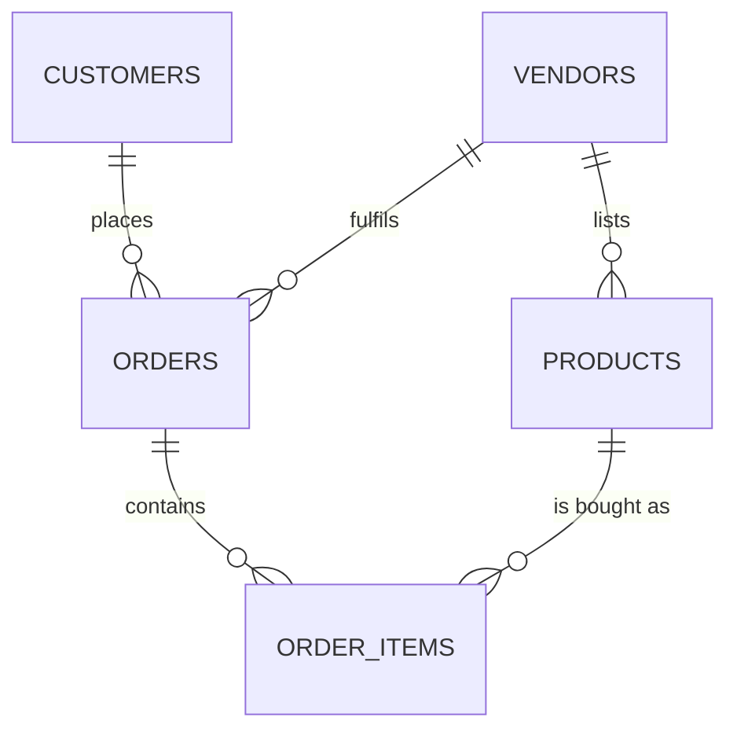

# Chapter 2 — Why a relational database for a marketplace

Before you write a single line of application code, you make a decision that quietly shapes every chapter after it: **what kind of database stores your marketplace's data?** It's the foundation the whole build stands on — get it right and the hard chapters (checkout, isolation, payouts) get easier; get it wrong and you'll fight your own data layer for four weeks.

This is a *concept* chapter. There's nothing to build yet — the goal is that by the end you can **explain and defend** the choice, the way you'd have to in a design review. That matters, because "why did you pick this database?" is one of the most common questions a senior engineer will ask you, and "it's what I knew" is not an answer that lands.

## The decision in front of you

Every database splits, at the top level, into two broad families:

- **Relational (SQL) databases** — PostgreSQL, MySQL, MariaDB. Data lives in **tables** with a defined schema, rows are linked by **keys**, and the database enforces rules about those links. You query with SQL.
- **Document (NoSQL) databases** — MongoDB, DynamoDB, Firestore. Data lives in flexible **documents** (think JSON), usually with no enforced schema, and related data is often **nested inside** a single document rather than linked across tables.

Both are good tools. The question is never "which is better" in the abstract — it's **which fits a multi-vendor marketplace**. So let's reason it out properly.

## The tempting choice — and why it disappoints here

If you've felt the friction of designing a schema and writing migrations, the document database is seductive: *"No rigid schema. I just save a JSON blob. Each maker's products can look however they want. I'll move fast."* For a marketplace of handmade goods — where a ceramic mug and a leather satchel genuinely have different attributes — that flexibility sounds like a perfect fit.

It's a real strength, and we'll come back to it. But hold it up against what a marketplace *actually has to guarantee*, and the cracks show. None of these requires you to build the broken version to believe them — they're structural:

**1. Checkout has to be all-or-nothing.** When a customer checks out a cart spanning three makers, a pile of things must happen together: create the orders, snapshot every price, decrement stock, record the (simulated) payment. If the process dies halfway, you must **not** end up with stock removed but no order, or an order with no payment. This is a **transaction** — a group of changes that either *all* commit or *all* roll back. Relational databases were built around this guarantee across many rows and tables.

To feel the tension, picture the *document* temptation — the whole order nested in one blob:

```jsonc
// One order, everything nested inside a single document
{
  "orderId": "ord_123",
  "customer": { "id": "cus_9", "name": "Ravi" },
  "items": [
    { "productId": "prod_55", "vendorId": "ven_2", "title": "Stoneware mug",   "price": 1800,  "qty": 2 },
    { "productId": "prod_91", "vendorId": "ven_7", "title": "Leather satchel",  "price": 12000, "qty": 1 }
  ]
}
```

It looks tidy — until you remember the *other* documents this one change must touch at the same instant: each product's **stock** has to drop, each vendor's **payout** ledger gains a line, the customer's record may update. Those live in *separate* documents, and changing them all-or-nothing is exactly the part document stores historically made hard. In the relational world the same change is one transaction across a few tables — which is the next section.

**2. Ownership and references must stay honest.** A product belongs to exactly one maker. An order line refers to a real product and a real customer. If a maker is removed, you can't have orphan products floating with a `vendor_id` that points at nobody. A relational database enforces this for you with **foreign keys** — it will *refuse* to store a product whose vendor doesn't exist, and refuse to delete a vendor who still has products (or cascade it deliberately). That guarantee is called **referential integrity**, and it's the difference between "the data can't be wrong" and "the data is correct as long as every developer remembers to check." A document store leaves that checking to your application code — forever, on every path.

**3. The catalogue is full of relationships you'll read across.** "Show this maker's products with their store name." "Show this order with each line's product and the maker who fulfils it." "Total each maker's sales this month." These are **joins** — combining related tables in one query — and relational databases are *built* to do them efficiently. In a document model, data you didn't nest together has to be stitched in application code, one lookup per item — which is precisely the **N+1 query** trap you'll meet head-on in Week 3. Starting on a foundation that makes joins natural saves you from designing that trap in from Day 1.

**4. Money demands correctness over convenience.** Orders, prices, and payouts are money. Money is the one place where "eventually consistent" and "probably fine" are not acceptable. The strong, immediate consistency guarantees of a relational database (the **ACID** properties — more on those below) are exactly what you want under a ledger.

Notice the pattern: a marketplace's hardest requirements are all about **relationships and guarantees between many pieces of data** — and that is the home turf of the relational model. The document database's superpower (a self-contained, flexible blob) is least useful exactly where a marketplace is hardest.

## The choice — and the concepts that justify it

For this project you'll use a **relational database**, and specifically **PostgreSQL** (Postgres). Let's make sure you can defend *why*, not just repeat it — because the reasons are the actual learning here.

### ACID and transactions — the guarantee under your money

Relational databases promise **ACID**:

- **Atomicity** — a transaction is all-or-nothing. (Your checkout, exactly.)
- **Consistency** — every committed transaction leaves the database obeying all its rules (foreign keys, constraints). You can never commit a half-valid state.
- **Isolation** — concurrent transactions don't trip over each other; each runs as if it were alone. (Two customers buying the last item at once won't both succeed.)
- **Durability** — once committed, it survives a crash.

Here's what a transaction *looks like* — the shape, not your checkout code (you'll write that in Chapter 47):

```sql
BEGIN;                                                  -- start: nothing is real yet
  INSERT INTO orders (...) VALUES (...);                -- create the order
  INSERT INTO order_items (...) VALUES (...);           -- add its lines, prices snapshotted
  UPDATE products SET stock = stock - 1 WHERE id = ...; -- decrement stock
  INSERT INTO payments (...) VALUES (...);              -- record the (simulated) payment
COMMIT;                                                 -- all of it lands together…
-- ROLLBACK;                                            -- …or if anything failed, NONE of it happened
```

Either every line commits, or the database throws all of it away and the data is exactly as it was before. That all-or-nothing boundary is *atomicity*, and it's why a half-finished checkout can never leave you with stock removed but no order.

For a marketplace, *Atomicity* and *Isolation* are not nice-to-haves — they're the reason checkout and stock and payouts can be trusted. You'll lean on them directly in [the checkout transaction (Chapter 47)](47-checkout-transaction.md).

### Foreign keys and referential integrity — correctness you don't have to remember

A **foreign key** is a column that points at another table's primary key, and the database enforces it. Picture the core links:



In schema terms, that guarantee is one phrase per link — for example, a product pointing at its vendor:

```sql
CREATE TABLE products (
  id         uuid PRIMARY KEY,
  vendor_id  uuid NOT NULL REFERENCES vendors(id),   -- the foreign key: must point at a REAL vendor
  -- … the rest of the product columns arrive in Chapter 9
);
```

With that `REFERENCES vendors(id)` in place, the database will **reject** any product whose `vendor_id` doesn't match a real vendor, and **refuse** to delete a vendor who still has products (unless you deliberately tell it to cascade). Every arrow in the diagram above is one of these guarantees: an `order_item` cannot reference a product that doesn't exist; a product cannot belong to a vendor who was deleted. This is your multi-tenant isolation and your data correctness, enforced at the lowest level — beneath any bug in your application code, on every path, forever. (You'll build this model in the **data-model module** (Chapters 8–14) and turn it into hard isolation in the **isolation module** ([Chapter 27 onward](27-isolation-concept.md)).)

### Joins and a schema — structure that pays off as you scale

A defined **schema** feels like a constraint when you're moving fast, but it's what lets the database *understand* your data well enough to optimise it: to index it, to plan an efficient **join**, to reject bad writes. The "rigidity" you trade away buys you query power and safety that a marketplace cashes in constantly.

A **join** combines related tables in one query. "This maker's products, with their store name" is a single trip to the database:

```sql
SELECT p.title, p.price_cents, s.name AS store_name
FROM products p
JOIN stores s ON s.vendor_id = p.vendor_id
WHERE p.vendor_id = $1;
```

One query; the database does the matching for you. In a document model where stores and products sit in separate collections, you'd fetch the products and then loop, fetching each store one by one — *N+1* queries instead of one. Relational databases are *built* to make the single-query version natural, which is the payoff you'll cash in all through Week 3 — and the trap (N+1) you'll meet in [Chapter 36](36-n-plus-1.md).

> 💡 **Hint — a way to test any "which database?" decision.** List the three or four things your system absolutely must never get wrong. For a marketplace that's *money, ownership, and stock*. Then ask which model enforces those for you versus which leaves them to application code you must write perfectly every time. The answer usually picks itself.

## Being fair: where document databases win — and the hybrid you'll actually use

Good engineering isn't tribal, and in a design review you'll be expected to know the *other* side. Document databases genuinely shine when — and let's use *our* marketplace for each, not abstract examples:

- **Your data is self-contained and read as a whole.** Think of a single product's full detail shown on its page, or a maker's "about this store" blurb — fetched and rendered in one go, rarely joined to anything else.
- **The shape varies wildly and you rarely query *across* records.** This is exactly our per-product attributes: a mug's `capacity_ml` and `dishwasher_safe` share nothing with a satchel's `dimensions` and `leather_type`, and no customer searches "all products where dishwasher_safe = true" across the whole catalogue.
- **You need to scale writes horizontally** beyond what a single relational primary comfortably handles, and you can relax strict cross-record consistency to get it. For us that would be something like an append-only stream of "product viewed" events for analytics — sheer volume matters there, transactional correctness doesn't.

Two of those three are things our marketplace genuinely has — so the tension is real, not academic. The **variable product attributes** especially are a true fit for the document model. So should you reach for MongoDB after all?

The production answer isn't to switch databases — it's that **Postgres gives you both**. It has a **JSONB** column type that stores a flexible, queryable JSON document *inside* a relational row. So your `products` table keeps the structured, related, must-be-correct columns (id, `vendor_id`, price, stock) as real columns with real foreign keys — and parks the free-form, per-category attributes in a JSONB field:

```
products
  id          uuid        (primary key)
  vendor_id   uuid        (foreign key → vendors.id)   ← relational: ownership, enforced
  price_cents integer                                  ← relational: money, exact
  stock       integer                                  ← relational: must be correct
  attributes  jsonb       { "capacity_ml": 350,        ← document: flexible per product
                            "dishwasher_safe": true }
```

And "JSONB" is not just "a text blob" — the **B** is for *binary*, and Postgres can index and query *into* it when you need to:

```sql
-- the structured columns behave like any relational data…
SELECT id, price_cents FROM products WHERE vendor_id = $1;

-- …and you can still reach inside the flexible attributes when it helps
SELECT id, price_cents
FROM products
WHERE attributes->>'dishwasher_safe' = 'true';
```

That's the best of both worlds, and it's a genuinely senior thing to be able to explain: *use the relational model for the relationships and guarantees, and reach for JSONB for the parts that are honestly schemaless.* You're not rejecting the document model — you're putting it exactly where it earns its place. (You'll design this `products` table in [Chapter 9](09-model-products.md).)

### Why Postgres specifically?

Relational-vs-document is the decision that matters; Postgres-vs-MySQL is a smaller one. Postgres is a strong default for this course because it has first-class **JSONB**, rich indexing (which you'll use in [Chapter 38](38-indexing.md)), excellent transactional behaviour, and is ubiquitous in production. If you're far more fluent in MySQL/MariaDB, that's a defensible choice too — the *reasoning* in this chapter is what's being graded, not the brand. (You'll lock the full toolset in the next chapter.)

## 📖 Mandatory reads

Read these before the data-model module (Chapter 8) — the next chapters assume you hold these ideas in your head, not just the conclusion above.

- **ACID & database transactions** — read the "Transactions" introduction in the **PostgreSQL documentation** (search: *"PostgreSQL documentation transactions"*). *Required: checkout (Chapter 47) is one big transaction; you need the mental model now.*
- **SQL vs NoSQL — when to use which** — read one balanced, non-marketing comparison (search: *"SQL vs NoSQL when to use it depends"*). *Required: you must be able to argue both sides, not just yours.*
- **Database normalisation (1NF → 3NF), a primer** — a short explainer (search: *"database normalization 1NF 2NF 3NF explained"*). *Required: the data-model module designs the schema, and Week 3 deliberately bends these rules for speed — you can't bend a rule you don't know.*

> **Interesting to read.** Shopify — one of the largest commerce platforms in the world — runs its core transactional data on **sharded MySQL**, relational at the heart, precisely for the correctness guarantees money demands. Search *"Shopify MySQL sharding"* for how they scaled a relational core to enormous size. It's a good antidote to "relational doesn't scale."

> **Make it yours.** You just made and justified a real architecture decision — that's a post. Write the short version, *"Why I chose a relational database (and JSONB) for my marketplace,"* using your own three must-never-get-it-wrong requirements as the argument. It's the first entry in a trail of write-ups that, by the end of this course, will read like an engineer who thinks out loud.

## Key takeaways — write them up (mandatory)

This is a concept chapter, so the gate isn't code you run — it's whether you can *defend the decision* **and** *explain every idea it rests on*. Both start with writing them down now.

> **✍️ Where your answers go.** Create a folder named **`learning-log/`** at the root of your project repo and commit it. For this chapter, add **`learning-log/02-why-relational.md`** and answer the prompts below there, in your own words. This is **mandatory** — your mentor (and the AI reviewer) reads these, and they're your rehearsal for the viva. One-line answers don't pass: write as if you're convincing a skeptical senior engineer, and use *our marketplace* in every example.

### Part A — The decision

1. **Why this database, for this project.** In 3–4 sentences, explain why you chose a relational database for *this* marketplace. Name the two marketplace requirements that drove it hardest, and why those two.
2. **Where you'd lose — and why you still don't switch.** Name one honest case in *our* marketplace where a pure document model would genuinely fit better. Then explain why you still don't add a second database for it.

### Part B — The topics you just learned

One short written answer each — these check that the ideas the decision rests on actually landed, not just the headline:

3. **Relational vs document.** In your own words, what's the core difference between the two — what does each one store, and what does each enforce (or leave to your app)?
4. **Transactions & ACID.** What is a transaction? Using our checkout (a cart with items from two makers), explain what *atomicity* means here and the exact bad state you'd risk without it.
5. **Foreign keys & referential integrity.** What does a foreign key guarantee? Using `products.vendor_id → vendors.id`, name two things the database will now *refuse* to do.
6. **Joins.** What is a join, in one sentence? Give one catalogue query our app runs constantly that needs one, and name the tables it touches.
7. **The JSONB hybrid.** How does Postgres let you keep relational guarantees *and* store wildly varying per-product attributes? On the `products` table, what belongs in real columns versus in the `attributes` JSONB field — and why?

*Gate: don't start Chapter 3 until all seven answers are written and committed in `learning-log/02-why-relational.md`, and you're confident saying each aloud. If one is shaky, that's your work for today — not the next chapter.*

---

Next: the database is decided — now pick the rest of the tools you'll build with, and why. → **[Chapter 3 — Choosing your stack & tools](03-choosing-your-stack.md)**
