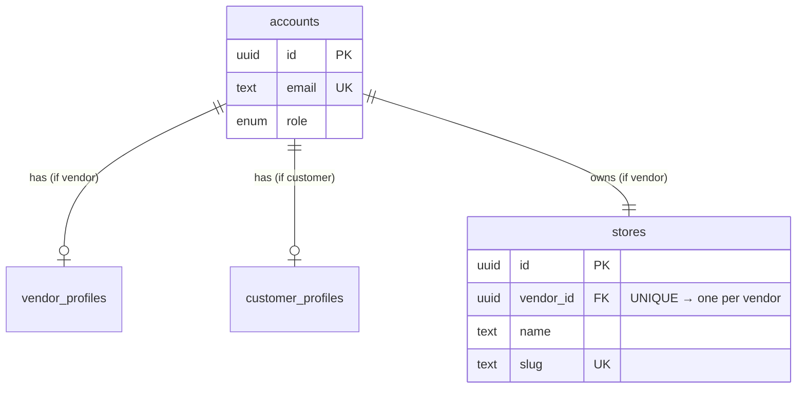

# Chapter 8 — Modelling vendors, stores, and customers

Your app runs, reads validated config, and reports its own health honestly. Everything so far has been *scaffolding* — important, but nothing a user would ever see. This chapter is where the marketplace starts to exist: you model the people in it and the thing a maker owns. And it's the first chapter where a mistake is *expensive*. A wrong status code in Chapter 7 is a five-minute fix; a wrong shape in your core tables is something every later feature inherits, and unwinding it once you have auth, orders, and isolation built on top is genuinely painful. So we slow down and decide deliberately.

We'll go step by step, and the decisions get sharper as we go: first *who* the actors are, then the one modelling decision that shapes everything (how to represent identity vs role), then ownership — the relationship the entire multi-vendor model rests on — and finally the keys themselves.

## Where we're headed

By the end you'll have a schema design — an ERD plus table definitions — for the three actors and their ownership: an **identity** table that every account shares, **role-specific** tables for vendors and customers, and a **stores** table owned by a vendor. It will have no sparse "everything" table, a clean ownership line from store to vendor, and opaque identifiers safe to put in a URL. Passwords and login come in Week 2; here we lay the ground they'll stand on.

## Step 1 — Name the actors and what they own

Go back to the actors from the introduction and write down the *nouns* and the *ownership arrows* between them:

- A **vendor** is a maker. They run a **store**.
- A **store** holds **products** (you'll model those in Chapter 9).
- A **customer** browses stores and places **orders** (Chapter 10).

Already an ownership structure is visible: a vendor *owns* a store, a store *owns* its products. That word — *owns* — is the most important one in this whole course. It's what later lets you guarantee one vendor can never touch another's data (Chapters 27–30). Get the ownership lines right here and that guarantee is easy later; get them wrong and it's nearly impossible. So every decision below is really asking the same question: *who owns what, and how do we write that down?*

## Step 2 — The decision that shapes everything: identity vs role

Here's the first real fork. You have vendors and customers — both are *people with accounts* who log in, but they do very different things. How do you represent them in tables? There are three approaches, and only one survives contact with a growing app.

**Approach A — one big `users` table with a `role` column.** Everyone, vendor or customer, lives in one table; a `role` column says which they are, and the table carries every column either kind might need:

```
users
─────────────────────────────────────────────────────────────────
 id │ email        │ role     │ payout_account │ shipping_address
────┼──────────────┼──────────┼────────────────┼──────────────────
  1 │ amid@…       │ vendor   │ acct_8842      │ NULL          ← customer fields empty
  2 │ priya@…      │ customer │ NULL           │ 12 Rose Lane  ← vendor fields empty
```

See the problem? Every vendor row has a `NULL` shipping address; every customer row has a `NULL` payout account. The table fills with **sparse nulls** — columns that are meaningless for half the rows. As vendors gain payout details, tax info, and store settings, and customers gain addresses, carts, and order history, this one table becomes a swamp of mostly-empty columns, and the database can't even enforce "a vendor *must* have a payout account" because the same column has to allow null for customers.

**Approach B — completely separate `vendors` and `customers` tables**, each with its own email and (later) password. This fixes the sparse nulls, but creates a worse problem: **identity is now duplicated**. Login has to check two tables to find an email. Enforcing "no two accounts share an email" across *both* tables is awkward. And a person who wants to be both a buyer and a seller needs two unrelated accounts. You've split the thing that should be shared (identity) along with the thing that genuinely differs (role data).

**Approach C — separate identity from role.** One **`accounts`** table holds what *every* account shares and what login needs — email, role, and later the password and verification state. Then each role gets its *own* table for the data that is uniquely theirs, linked back to `accounts` one-to-one. Identity lives once, in one place; role-specific data lives where it belongs.

This is a legitimate-alternatives decision, so weigh them honestly:

| Approach | Pros | Cons |
|---|---|---|
| **A — one `users` table + role** | Dead simple; one place to look | Sparse nulls; can't enforce role-required fields; degrades as roles diverge |
| **B — separate per-role tables** | No sparse nulls | Identity duplicated; login checks two tables; email-uniqueness awkward; can't be both |
| **C — identity + role tables** | Identity shared & enforced once; role data clean; extensible | One more table and a join to assemble a full picture |

**The course requires Approach C.** The single join it costs you is trivial; the clean separation it buys pays off in every auth, isolation, and feature chapter ahead. This is a foundational choice the rest of the course assumes — so it's decided, not optional. (This identity-vs-role split is the same principle you'll see again as *identity vs profile* when auth arrives in Week 2; it's worth searching *"database single table inheritance vs class table inheritance"* to see the general pattern.)

## Step 3 — The identity table: `accounts`

Model the shared identity first. It stays deliberately lean — only what every account has and what logging in needs:

```
accounts
──────────────────────────────────────────────
 id        (uuid, primary key)
 email     (text, UNIQUE, not null)   ← the natural login key
 role      (enum: 'vendor' | 'customer', not null)
 created_at(timestamptz, not null)
 -- password_hash & verification arrive in Week 2 (auth); design the seam, don't fill it yet
```

Two things to notice. **Email is `UNIQUE`** — it's how a person logs in, so the database itself must guarantee no two accounts share one (don't leave that to application code that can race). And **`role` is an enum**, not free text, so the database rejects a typo'd `'vendr'` before it ever becomes a bug. You're deferring the password to Week 2, but the *seam* is here: when auth arrives, the new columns slot into this one table and nothing else moves.

## Step 4 — The role tables: where a vendor's and a customer's own data lives

Each role gets a table for the data that is *only* theirs, linked one-to-one to `accounts`:

```
vendor_profiles
──────────────────────────────────────────────
 account_id   (uuid, FK → accounts, UNIQUE — one-to-one)
 display_name (text)
 bio          (text)
 -- payout details, tax info, etc. grow here later
```

```
customer_profiles
──────────────────────────────────────────────
 account_id   (uuid, FK → accounts, UNIQUE — one-to-one)
 full_name    (text)
 -- saved shipping addresses, etc. grow here later
```

Right now these tables hold little — and that's fine. You're not over-engineering; you're putting the *home* in place before the furniture arrives. When a vendor gains payout accounts and a customer gains saved addresses, they flow into these tables and never pollute the identity that login depends on. The `account_id` foreign key is marked **`UNIQUE`**, which is what makes the link *one-to-one*: exactly one vendor profile per account, never two.

> 💡 **Hint — one-to-one vs one-to-many, made concrete.** The difference is entirely in that `UNIQUE` on the foreign key. A foreign key *without* `UNIQUE` is one-to-many (many products can point to one store). The *same* foreign key *with* `UNIQUE` is one-to-one (only one profile may point to one account). Same mechanism, one constraint apart — keep that in your head, it decides a lot of relationships.

## Step 5 — The store: ownership, the relationship everything rests on

Now the heart of the model. A vendor runs a **store** — and the store is not just columns on the vendor row, it's its own entity with its own name, slug, and description, and (Chapter 9) its own products. Give it its own table, owned by a vendor through a foreign key:

```
stores
──────────────────────────────────────────────
 id         (uuid, primary key)
 vendor_id  (uuid, FK → accounts, UNIQUE)   ← the OWNERSHIP line, and one store per vendor
 name       (text, not null)
 slug       (text, UNIQUE)                  ← the store's URL handle, e.g. /stores/clay-and-co
 created_at (timestamptz, not null)
```

That `vendor_id` is the single most important column in the schema. It is the **ownership boundary**: products will belong to a store, the store belongs to a vendor, and that chain is exactly what lets you later prove "this product is yours to edit, that one isn't." When you build multi-tenant isolation in Week 2, every protective query traces back to this column. Model it cleanly now and that work is a join; model it loosely and it's a rewrite.

There's a real decision in the `UNIQUE` here: **one store per vendor, or many?** A handmade-goods marketplace is a shop-per-maker world, so the course mandates **one store per vendor** — enforced by `UNIQUE` on `vendor_id`. (Letting a vendor run several storefronts is a fine bar-raiser for the end of the course, and because you modelled this as a foreign key rather than as columns on the vendor, relaxing it later is just *dropping* the `UNIQUE` — not restructuring anything.)

Here is the whole model so far:



## Step 6 — The keys: why your IDs should be unguessable

One last decision, and it's a genuinely advanced one that most tutorials get wrong. What *type* is a primary key — a sequential integer (`1, 2, 3…`) or a **UUID** (`b4f1…` — a random, opaque identifier)?

Sequential integers are the default everywhere, and in a multi-vendor marketplace they're a quiet liability. Two reasons, both concrete:

- **They leak business information.** If a customer's order is `/orders/1043`, they learn you've had about a thousand orders. A competitor watching their own order numbers climb can estimate your daily volume. The id itself is a data leak.
- **They're guessable — which is an attack vector.** This is the one that matters. In a system where vendors and customers must only see *their own* data, a URL like `/stores/41/products/88` invites an attacker to just try `89`, `90`, `91` and walk the whole table. That attack has a name — **IDOR**, insecure direct object reference — and you'll defend against it directly in Chapter 29. Sequential ids hand the attacker the map.

A **UUID** is random and opaque: `/orders/b4f1c2e8-…` tells an attacker nothing and can't be incremented to the next record. It costs slightly more storage and is less human-readable, but for anything whose id appears in a URL or an API response, that trade is worth it.

| Key type | Pros | Cons |
|---|---|---|
| **Serial integer** | Compact, ordered, human-readable | Leaks counts; guessable → enables IDOR walking |
| **UUID** | Opaque; safe to expose; not enumerable | Larger; not human-ordered |

**The course requires UUIDs** for every entity whose id is exposed to clients (accounts, stores, products, orders) — which is why every table above uses `uuid` for its primary key. Defence against IDOR starts here, in the choice of key, long before the isolation chapter makes it explicit.

> **📖 Mandatory read — before Chapter 9.** Read a short piece on **database normalisation basics** (first and second normal form — search *"database normalization 1NF 2NF explained"*) and skim one on **UUID vs auto-increment primary keys**. *Required: Chapter 9 models products with variable attributes, and you'll lean on knowing why a value belongs in its own table versus crammed into one.*

> **Interesting to read.** IDOR — exactly the sequential-id attack above — is a perennial entry on the **OWASP** list of top web vulnerabilities, and real companies have leaked customer records because an id in a URL could simply be incremented. Search *"IDOR broken object level authorization"* to see how ordinary the mistake is — and why you're designing it out from the very first table.

## Definition of Done

Things you can **see or show** — and the gate to Chapter 9:

- [ ] An **ERD** exists showing `accounts`, `vendor_profiles`, `customer_profiles`, and `stores`, with the ownership arrows between them
- [ ] **Identity is separated from role:** one `accounts` table carries email + role; role-specific data lives in its own table — there is **no single "everything" table of sparse nulls**
- [ ] `email` is **unique** on `accounts`, and `role` is constrained to a fixed set (enum), not free text
- [ ] A **store belongs to exactly one vendor** via a `vendor_id` foreign key marked `UNIQUE` (one store per vendor)
- [ ] Every entity's primary key is a **UUID**, not a sequential integer
- [ ] The table definitions (DDL) for all four tables are written and committed (you'll formalise these as runnable migrations in Chapter 12)
- [ ] No passwords or auth fields yet — the seam for them is left in `accounts`, deliberately empty

> **✍️ Log it (mandatory).** In `learning-log/08-model-vendors-stores-customers.md` — first the **decision**, then the **topics**: **(Decision)** Why does this marketplace split identity (`accounts`) from role-specific data instead of one `users` table — answer with the *concrete* failure the single-table approach hits as the app grows. Why is `stores` its own table owned by a vendor, rather than columns on the vendor? **(Topics)** (1) What are "sparse nulls" and which approach causes them? (2) How is a one-to-one relationship modelled differently from a one-to-many, using these tables as your example? (3) Why are sequential integer ids a risk in *this* multi-vendor app specifically — name the attack they enable? (4) Which single column is the "ownership boundary," and what future guarantee does it make possible?

*All boxes ticked and the log written? Then continue. You've placed the actors and the ownership line they hang from — next you give the store something to sell.*

---

Next: a store needs products — and handmade goods have wildly different attributes (a mug's glaze, a scarf's fibre). Modelling that flexibly without a swamp of nulls is its own decision. → **[Chapter 9 — Modelling products with variable attributes](09-model-products.md)**
