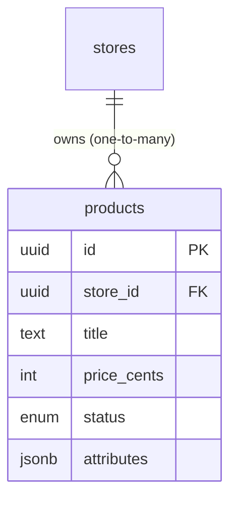

# Chapter 9 — Modelling products with variable attributes

Your store exists and is owned by a vendor (Chapter 8). Now it needs the thing it's actually for: products. On a marketplace that sold one kind of item — say, only books — this would be a five-minute table. But you're building for **independent makers of handmade goods**, and that turns out to be one of the genuinely hard modelling problems, because no two makers' products share the same shape. A potter's mug has a glaze and a capacity; a weaver's scarf has a fibre and a length; a printmaker's poster has dimensions and a paper stock. They're all "products," they all live in one catalogue, but they refuse to fit one fixed list of columns.

This chapter is where you solve that — and it's a step up in difficulty, because the obvious answers are both *wrong in interesting ways*, and the right answer is a deliberate blend. We'll also confront a decision every commerce app must get right and many get subtly wrong: how to store money.

## Where we're headed

By the end you'll have a `products` table owned by a store, with **typed columns for what every product shares** (ownership, title, price, status) and **a single JSONB column for the attributes that vary by item**. You'll have a clear rule for deciding which fields go where, and you'll store money in a way that can't silently corrupt a customer's total.

## Step 1 — The problem: products that won't fit one shape

Lay three of your makers' products side by side and the tension is obvious:

```
A mug        → glaze: "celadon",  capacity_ml: 350,  microwave_safe: true
A scarf      → fibre: "merino",   length_cm: 180,    care: "hand wash"
A poster     → width_cm: 50,      height_cm: 70,     paper: "matte 200gsm"
```

Every product needs a **title, a price, a description, an owner, and a status** — those are universal. But beyond that, each *type* of item carries its own attributes that the others have no use for. You need them all in one catalogue (one search, one listing, one orders system), yet they share only part of their structure. So: how do you put "things that are mostly the same but partly different" into a table?

## Step 2 — The two tempting traps

There are two obvious answers. Both feel reasonable and both fail — it's worth understanding *why*, because the failure of each is what points at the right design.

**Trap A — a column for every attribute.** Make one wide `products` table with a column for everything any product might have:

```
products  (the wide-table trap)
─────────────────────────────────────────────────────────────────────
 id │ title │ price │ glaze   │ capacity_ml │ fibre │ length_cm │ paper …
────┼───────┼───────┼─────────┼─────────────┼───────┼───────────┼───────
 …  │ Mug   │  …    │ celadon │ 350         │ NULL  │ NULL      │ NULL
 …  │ Scarf │  …    │ NULL    │ NULL        │ merino│ 180       │ NULL
```

This is the **sparse-nulls** problem from Chapter 8, back at a worse scale — most columns are `NULL` for most rows. And it has a fatal second flaw: **every new kind of product needs an `ALTER TABLE`**. The day a maker lists candles, you're migrating the schema to add `burn_time_hours`. A marketplace where adding a product type means a database migration cannot grow. The schema explodes and the table is mostly empty.

**Trap B — Entity-Attribute-Value (EAV).** Stung by the wide table, the instinct is to go fully flexible: store every attribute as a *row* in a generic table.

```
product_attributes  (the EAV trap)
──────────────────────────────────────────
 product_id │ key          │ value
────────────┼──────────────┼──────────
 mug-1      │ glaze        │ celadon
 mug-1      │ capacity_ml  │ 350
 scarf-1    │ fibre        │ merino
```

Now any product can have any attribute, no migrations ever. But you've traded one problem for a worse one. To reconstruct a *single* product's attributes you join and pivot many rows. Everything is text, so `capacity_ml` has no number type and no `>= 0` check — the database can't protect the data. Filtering ("mugs over 300ml") becomes a painful self-join, and it indexes poorly. EAV is famous enough to be an anti-pattern with a nickname: *"the database inside your database."* It looks flexible and reads like a riddle.

## Step 3 — The right approach: the hybrid

The wide table was too rigid; EAV was too loose. The professional answer splits the difference along the natural seam you already spotted in Step 1: **the universal fields are structured columns, and the variable fields live together in one JSONB column.**

JSONB is PostgreSQL's binary JSON type — it stores a JSON document *inside a single column*, and unlike plain text it can be queried and indexed. So a product gets real, typed, constrained columns for what every product shares, plus one `attributes` column holding a little JSON document of whatever is specific to that item:

```
A mug:   columns → title, price, status…   attributes → { "glaze": "celadon", "capacity_ml": 350 }
A scarf: columns → title, price, status…   attributes → { "fibre": "merino", "length_cm": 180 }
```

One table holds both, with no schema change to add candles tomorrow — and the core fields keep full relational integrity.

| Approach | Flexibility | Integrity on core fields | Query & index | Verdict |
|---|---|---|---|---|
| **A — wide table** | None (migration per type) | Good | Good | Can't grow |
| **B — EAV** | Total | None (all text, no constraints) | Painful | Unmaintainable |
| **C — hybrid (columns + JSONB)** | High (any attributes, no migration) | Good (on the columns that matter) | Good on columns, workable on JSONB | **Required** |

**The course requires the hybrid.** It is the standard way real commerce platforms model a catalogue of dissimilar items, and it's the one design that keeps the data both flexible *and* trustworthy.

## Step 4 — The rule: column or JSONB?

The hybrid only works if you put each field on the right side of the line. Here's the rule, and it's worth memorising because you'll apply it constantly:

> **A field earns a real column if it is universal *and* you filter, sort, join, or enforce a rule on it. Otherwise — if it's specific to a product type, or only ever displayed — it belongs in JSONB.**

Walk the examples through it:

- **`price`** — every product has it, you sort and filter by it, and it needs a "can't be negative" rule. → **Column**, unmistakably.
- **`status`** (draft / published) — every product has it and you filter on it ("show only published"). → **Column**.
- **`glaze`, `fibre`, `paper`** — specific to one product type, mostly for display on the product page. → **JSONB**.
- **`capacity_ml`** — only mugs have it; you probably don't filter the *whole* catalogue by it. → **JSONB** (and if one day you *do* need to filter every product by it, that's your signal to *promote* it to a column).

That last point is the mindset: the line isn't permanent. A field can start in JSONB and graduate to a column the day it becomes something you query for everyone. JSONB is for the long, varied tail; columns are for the spine.

## Step 5 — The products table, owned by a store

Now write it, carrying the ownership chain forward from Chapter 8 — a product belongs to a **store**:

```
products
──────────────────────────────────────────────
 id          (uuid, primary key)
 store_id    (uuid, FK → stores)         ← ownership; NOT unique → a store has many products
 title       (text, not null)
 description (text)
 price_cents (integer, not null, CHECK price_cents >= 0)   ← money; see Step 6
 currency    (text, not null)            ← e.g. 'USD'; price is meaningless without it
 status      (enum: 'draft' | 'published', not null, default 'draft')
 attributes  (jsonb, not null, default '{}')  ← the variable, type-specific fields
 created_at  (timestamptz, not null)
```

Notice `store_id` is a foreign key **without** `UNIQUE` — and that single difference, exactly as the Chapter 8 hint promised, is what makes this **one-to-many**: one store owns many products. This `store_id` extends the ownership boundary one link further: a product belongs to a store, a store belongs to a vendor, so "is this product yours to edit?" traces back through this column to a vendor. That chain is what Week 2's isolation work will enforce.



## Step 6 — Money is not a floating-point number

This is the decision many apps get wrong, so we make it deliberately. The instinct is to store a price like `$19.99` as a floating-point number (`19.99`). **Don't** — and here's the concrete reason. Floating-point numbers can't represent most decimal fractions exactly; the classic demonstration is that `0.1 + 0.2` does not equal `0.3` in floating-point arithmetic, it equals `0.30000000000000004`. One stray fraction of a cent looks harmless — until it's multiplied across a cart, summed into an order total, and reconciled against a payout, and now your books are off by amounts that are maddening to trace. Money must be *exact*.

Two correct options exist:

- **Integer minor units** — store the price as a whole number of the smallest currency unit (cents): `$19.99` becomes `1999`. All arithmetic is integer arithmetic, which is exact; you divide by 100 only for display.
- **A fixed-precision decimal type** — Postgres's `NUMERIC(12,2)`, which stores decimals exactly (no binary float involved).

**The course requires integer minor units** (`price_cents`, as in the table above) — it's unambiguous, fast, and impossible to accidentally do float math on. And always pair the amount with a **currency** column: `1999` means nothing until you know whether it's dollars or yen. (The `CHECK price_cents >= 0` constraint is the database refusing to store a negative price — integrity you get for free by using a real column, which is exactly why `price` could never live in JSONB.)

> 💡 **Hint — JSONB isn't a junk drawer.** Flexibility tempts you to throw *everything* into `attributes`. Resist it. The moment you find yourself wanting to filter or sort the whole catalogue by something in JSONB, that something wanted to be a column. JSONB querying is real (Postgres has operators like `->>` to read a key, and `@>` to match a document, and you *can* index it), but a plain column is simpler, faster, and constraint-checked. Use JSONB for the genuinely variable tail — not as an excuse to avoid deciding.

> **📖 Mandatory read — before Chapter 10.** Read PostgreSQL's own short intro to **JSONB** (search *"postgres jsonb when to use"*) — what it is, JSON vs JSONB, and that it can be indexed — and one piece on **why you never store money as a float** (search *"storing money integer cents floating point"*). *Required: Chapter 10 models orders that snapshot these prices, and the money decision here carries straight into it.*

> **Interesting to read.** Floating-point money bugs are not hypothetical — trading systems, billing platforms, and games have all shipped rounding errors that quietly lost or invented money at scale, and "never use float for currency" is gospel in finance engineering for exactly this reason. Search *"floating point money bug"* to see how a fraction of a cent becomes a real incident.

## Definition of Done

Things you can **see or show** — and the gate to Chapter 10:

- [ ] A `products` table exists with a `store_id` **foreign key (not unique)** — one store, many products
- [ ] **Universal fields are typed columns** (title, price, status, currency); **variable, type-specific attributes live in a single `jsonb` column**
- [ ] You can represent a **mug and a scarf in the same table** with no schema change — only their `attributes` JSON differs
- [ ] **Price is stored as integer minor units** (e.g. `price_cents`), never a float, with a `CHECK` that it can't be negative, and a paired **currency** column
- [ ] `status` is constrained to a fixed set (enum), defaulting to `draft`
- [ ] The DDL is written and committed (formalised as a migration in Chapter 12)

> **✍️ Log it (mandatory).** In `learning-log/09-model-products.md` — **decision** first, then **topics**: **(Decision)** Why does this catalogue use the hybrid (columns + JSONB) instead of a wide table or EAV — give the concrete failure of *each* trap for a marketplace of dissimilar handmade goods. What is your rule for deciding whether a field is a column or a JSONB attribute? **(Topics)** (1) What is the "sparse nulls" failure of the wide-table approach, and why does adding a product type make it worse? (2) Why is EAV called "a database inside your database" — what does reconstructing one product cost? (3) Why must `price` never be a floating-point number — describe the exact way the error compounds? (4) When should a field *move* from JSONB into its own column?

*All boxes ticked and the log written? Then continue. The store can now hold any product a maker dreams up — next we let customers buy them, which raises the hardest integrity question yet.*

---

Next: a customer buys from several makers at once — so one checkout must become several per-vendor orders, each remembering exactly what was paid. → **[Chapter 10 — Modelling orders](10-model-orders.md)**
