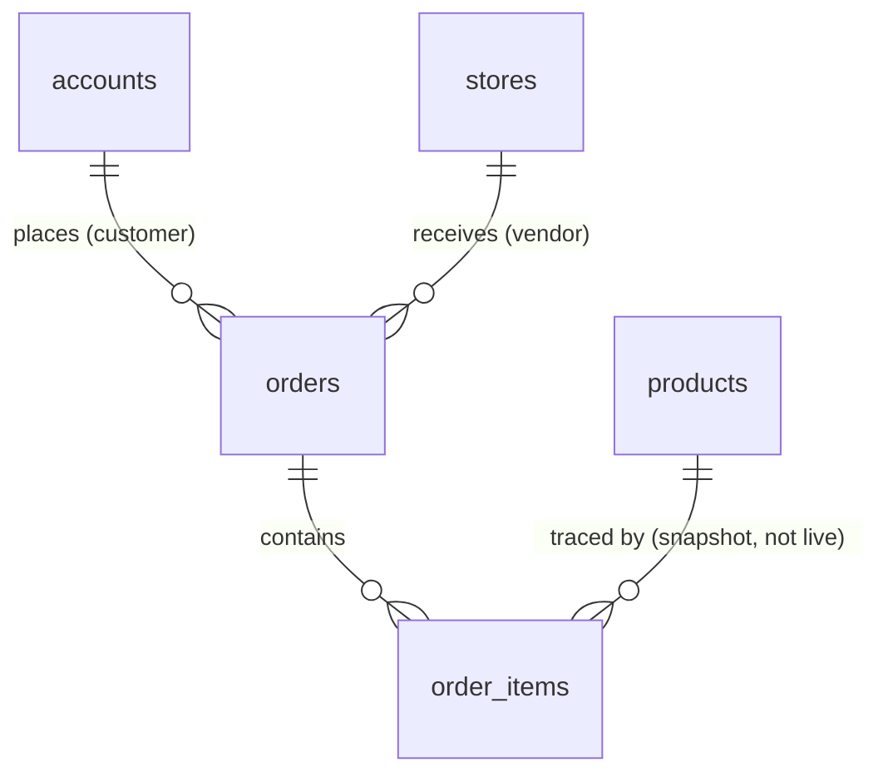

# Chapter 10 — Modelling orders

You can model people, ownership, and a catalogue of dissimilar products. Now the transaction — and this is the hardest integrity chapter in the entire data model, because a marketplace order raises two problems an ordinary shop never faces. First, **one customer's cart spans many makers**, so a single checkout is not one order. Second, **an order must remember exactly what was bought and paid, forever** — even after the vendor changes the price, renames the product, or deletes it entirely. Get either wrong and the damage is the worst kind: silent, retroactive corruption of records people have already paid for.

We'll build it step by step, and every step is a decision with a concrete failure on the wrong side. This is the chapter the snapshot rule from Chapter 9 was setting up.

## Where we're headed

By the end you'll have an orders model that does three things correctly: it **splits one checkout into one order per vendor**, it records each purchased line as a **price snapshot frozen at the moment of sale**, and it tracks **each order's status independently**. Money stays in integer minor units, exactly as in Chapter 9.

## Step 1 — Why a marketplace checkout is *not* one order

Picture a real cart: a customer adds a celadon mug from *Clay & Co* and a merino scarf from *WoolWorks*, and pays once. It *feels* like one order. But ask the questions that actually run a marketplace:

- **Who fulfils it?** Two different makers, each shipping their own item, independently.
- **Who gets paid?** Each vendor, for their own items — not one lump.
- **What if one cancels?** Clay & Co running out of stock must not cancel the scarf.

So conceptually this is **two orders that happened to be paid together**. That reframing decides the model:

**The tempting approach — one order holding every item.** A single `orders` row with line items from both vendors. It feels simpler, and it's wrong on every question above. Vendor A, viewing "their" order, sees vendor B's items and the customer's full basket — a direct breach of the isolation you've been building toward since Chapter 8. Fulfilment and payout, which are *per vendor*, now have to be untangled out of a shared order. And one vendor's cancellation touches an order that isn't wholly theirs.

**The right approach — split at checkout into one order per vendor.** Each order belongs to exactly **one store**, contains **only that store's items**, and has its own status and its own payout. The single payment that created them all is recorded as a **checkout** (a grouping the customer sees as "my purchase"), but each order beneath it is independent. Clay & Co gets an order; WoolWorks gets an order; the customer made one payment.

```
        Checkout  (one payment by the customer)
        ┌──────────────────────────────────────┐
        │  Order → Clay & Co     (the mug)      │   ← independent status, payout
        │  Order → WoolWorks     (the scarf)    │   ← independent status, payout
        └──────────────────────────────────────┘
```

**The course requires the split: one order per vendor per checkout.** It's the decision that makes the rest of the marketplace — isolation, vendor dashboards, payouts — even *possible*. (You'll build the actual splitting logic at checkout in Chapter 45; here you model the shape it produces.)

## Step 2 — An order is a header plus line items

A single order still holds *several* products (a customer might buy two mugs and a bowl from Clay & Co). So an order is not one row — it's a **header** and its **line items**, the same one-to-many shape from Chapters 8 and 9:

- **`orders`** — the header: which customer, which store, the status, the total, when.
- **`order_items`** — one row per product line: which product, how many, at what price.

You could be tempted to cram the items into a JSON array on the order row. Resist it for the same reason `price` wasn't JSONB in Chapter 9: each line is a real entity with a quantity, a snapshot, and its own need to be queried (a vendor's best-selling product is a query *across* line items). Line items earn their own table.

## Step 3 — The price snapshot: the rule that defines a correct order

Here is the single most important idea in this chapter, and the canonical marketplace mistake. When you record a line item, what do you store about the product?

**The tempting approach — store only `product_id` and `quantity`,** then look up the price by joining to the `products` table whenever you display the order. It looks beautifully normalised. It is a time bomb.

Trace it concretely. A customer buys the mug today for **$20**. Next week the maker raises the mug to **$25**. Now every past order that joins to `products` for its price displays **$25** — including this customer's. The order *rewrote its own history*. The total no longer matches what was charged. The receipt is wrong. The accounting is wrong. And if the maker *deletes* the mug, the line item points at nothing and the order can't even be displayed. An order that reads its prices live from a mutable catalogue is not a record of a sale — it's a guess about the present.

**The right approach — snapshot.** At the moment of purchase, **copy** the price and the essential product details *onto the order line* and freeze them there:

- `unit_price_cents` — what this item cost *at the time of sale*, copied from the product then, never read live again.
- `title_snapshot` — the product's name as it was, so the receipt reads correctly even if the product is later renamed or deleted.

The line item *still* keeps `product_id` — but only for **traceability** ("which catalogue item was this?"), never as the source of the money or the name shown. The order becomes a **self-contained historical record**: change the catalogue all you like, the order remembers exactly what happened. This is mandatory, and it's the heart of a correct commerce system.

## Step 4 — The `order_items` table

```
order_items
──────────────────────────────────────────────
 id               (uuid, primary key)
 order_id         (uuid, FK → orders)        ← the header it belongs to
 product_id       (uuid, FK → products)      ← traceability only, NOT the price source
 title_snapshot   (text, not null)           ← the name as sold (survives rename/delete)
 unit_price_cents (integer, not null, CHECK >= 0)   ← snapshot of the price at sale time
 quantity         (integer, not null, CHECK quantity >= 1)
 line_total_cents (integer, not null)         ← unit_price_cents × quantity, frozen
```

Every money field is integer minor units (Chapter 9), and the `CHECK`s let the database itself refuse a negative price or a zero-quantity line. The two `*_snapshot` fields are what make the order immune to catalogue changes.

## Step 5 — The `orders` header and its independent status

```
orders
──────────────────────────────────────────────
 id          (uuid, primary key)
 store_id    (uuid, FK → stores)      ← which vendor this order is FOR (an isolation boundary)
 customer_id (uuid, FK → accounts)    ← who placed it (the other isolation boundary)
 checkout_id (uuid)                   ← groups sibling orders from one payment (see Ch 45)
 status      (enum: 'pending'|'paid'|'shipped'|'delivered'|'cancelled', not null)
 total_cents (integer, not null)      ← snapshot: the sum of the line totals at sale time
 currency    (text, not null)
 created_at  (timestamptz, not null)
```

Two ownership lines meet here, and both matter for Week 2: `store_id` is how a *vendor* sees only their orders; `customer_id` is how a *customer* sees only theirs. And `status` lives on the *order*, not the checkout, precisely because each vendor fulfils independently — Clay & Co can be `shipped` while WoolWorks is still `pending`. A single shared status could never describe two makers moving at different speeds.



## Step 6 — The total: store it or compute it?

Last decision, and it's a subtle one. The order's `total_cents` — do you recompute it from the line items every time, or store it on the header?

For most data, computing on the fly avoids the risk of a stored value drifting out of sync. But an order is special: its lines are *already snapshots*, so its total is part of the same frozen historical record. **Store the total**, captured at sale time as the sum of the line snapshots. Recomputing it later from anything mutable would reopen the exact hole the snapshots closed. This is **denormalisation for the sake of history** — a legitimate, deliberate copy (distinct from denormalising for *speed*, which you'll weigh in Chapter 14). The one rule it creates: the stored total must equal the sum of its lines at the instant they're written — a consistency guarantee that's a perfect motivation for wrapping the whole checkout in a single transaction (Chapter 47).

> 💡 **Hint — "snapshot" means copy, not reference.** The test for whether you've snapshotted correctly: delete a product in your head. Does the order still display correctly — right name, right price, right total? If displaying an old order requires the product to still exist with its original price, you referenced when you should have copied. A finished order should never need the catalogue to render.

> **📖 Mandatory read — before Chapter 11.** Read a short piece on **immutable records / snapshotting historical data** (search *"why store price at time of order"* or *"order line item price snapshot"*) and one on **modelling orders and line items**. *Required: Chapter 11 makes these relationships enforceable, and the snapshot decision directly shapes what "delete" should even mean for a product that's been sold.*

> **Interesting to read.** Almost every mature e-commerce platform snapshots the price (and often the full product details) onto the order at purchase — it's why your old receipts still show the price you actually paid years later, even after the item's price changed ten times. Search *"capture price at time of purchase ecommerce"* to see it treated as a first principle, not an optimisation.

## Definition of Done

Things you can **see or show** — and the gate to Chapter 11:

- [ ] One checkout produces **one order per vendor (store)**; each order contains **only that store's items**
- [ ] An order is a **header (`orders`) plus line items (`order_items`)** in a one-to-many relationship
- [ ] Each line item **snapshots the unit price (integer cents) and product title** at sale time; it keeps `product_id` only for traceability
- [ ] **Changing a product's price or title later does not change any existing order** — you can describe exactly why
- [ ] Each order carries its **own status** (enum) and a **stored total** captured at sale time
- [ ] All money is integer minor units with a currency; `CHECK`s forbid negative prices and zero quantities
- [ ] The DDL for `orders` and `order_items` is written and committed (migrated in Chapter 12)

> **✍️ Log it (mandatory).** In `learning-log/10-model-orders.md` — **decision** first, then **topics**: **(Decision)** Why does one checkout split into one order *per vendor* in this marketplace — name the things that break if it doesn't? Why snapshot the price onto the line item instead of joining to `products`? **(Topics)** (1) What exactly goes wrong if all of a cart's items share one order regardless of vendor? (2) Walk through the price-change scenario for an order that stored only `product_id` — where precisely does it corrupt? (3) Why is an order modelled as a header plus line items rather than one row? (4) Why is the order *total* stored rather than computed, when most values are better computed?

*All boxes ticked and the log written? Then continue. Your tables now describe the whole marketplace — next you make the database itself enforce the relationships between them, so bad data can't exist even if your code has a bug.*

---

Next: you've drawn relationships with foreign keys all through these chapters — now make them real, and decide what the database should do when something they point to is deleted. → **[Chapter 11 — Foreign keys and constraints](11-foreign-keys-and-constraints.md)**
